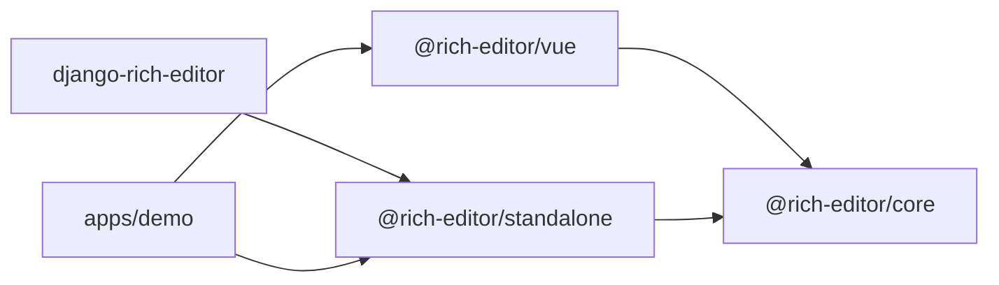

# 1. Обзор

## Назначение

Библиотека — rich-text-редактор для образовательной платформы на замену
Froala + Wiris MathType. Документ — обычная HTML-строка: она входит в редактор,
хранится в базе, показывается вьюером без редактора и открывается снова.
Формулы (математика и химия) хранятся в MathML и рисуются в SVG, медиа
загружаются через адаптер хоста, всё входящее проходит санитайзер с одним
allowlist на клиенте и сервере.

## Когда использовать

- Нужен редактор с формулами, картинками, голосовыми сообщениями и вложениями,
  который отдаёт и принимает HTML.
- Нужно показывать сохранённые документы на страницах без редактора.
- Нужно открывать документы, созданные в Froala/Wiris, без миграции данных.

## Интерфейс

### Пакеты

| Пакет | Каталог | Что внутри |
| --- | --- | --- |
| `@rich-editor/core` | `packages/editor-core` | Движок, редактор с тулбаром, вьюер, формулы, загрузки, i18n; входы `.` и `./viewer`; стили подключаются сами, файлы `styles.css`, `viewer.css`, `legacy.css` — для `<link>` |
| `@rich-editor/vue` | `packages/editor-vue` | Компоненты `RichEditor`, `RichContent`, `RteIcon`, плагин; реэкспорт API ядра; вход `./viewer` только с `RichContent` |
| `@rich-editor/standalone` | `packages/editor-standalone` | Та же библиотека одной ES-сборкой со всеми зависимостями: `editor.js`, `viewer.js`, стили, шрифты |
| `django-rich-editor` | `packages/django-rich-editor` | Виджет и поля Django, серверный санитайзер, вьюхи загрузок, теги шаблонов |
| демо | `apps/demo` | Три страницы: Vue, ядро без фреймворка, standalone как статика |

Что брать:

| Ситуация | Точка входа | Раздел |
| --- | --- | --- |
| Приложение на Vue 3 | `RichEditor`, `RichContent` из `@rich-editor/vue` | [07-vue.md](07-vue.md) |
| Другой фреймворк или его нет | `createRichEditor`, `createRichContent` из `@rich-editor/core` | [03-vanilla-ui.md](03-vanilla-ui.md) |
| Свой интерфейс поверх движка | `RichEditorCore` | [02-core.md](02-core.md) |
| Страница без бандлера, CDN | `editor.js`, `viewer.js` из `@rich-editor/standalone` | [10-standalone-and-django.md](10-standalone-and-django.md) |
| Django | `RichTextField`, `RichEditorWidget`, теги шаблонов | [10-standalone-and-django.md](10-standalone-and-django.md) |

### Как связаны пакеты



`@rich-editor/core` оставляет TipTap, MathJax, MathLive и DOMPurify внешними
зависимостями — их ставит бандлер хоста. `@rich-editor/standalone` собирает
всё внутрь; `django-rich-editor` кладёт эту сборку в свою статику.

### Путь документа

| Шаг | Что происходит |
| --- | --- |
| Вход | `content`, `setHTML()`, вставка из буфера, `html` вьюера — всё идёт через `prepareIncomingHtml()` |
| `prepareIncomingHtml()` | При `legacy: true` поднимает разметку Froala/Wiris; сырой `<math>` превращает в узел формулы; санитизирует |
| Редактирование | Формула, голосовое сообщение и вложение — атомарные узлы: выделяются и удаляются целиком |
| Выход | `getHTML()` синхронный; SVG формул берётся из кэша — перед экспортом дождитесь `whenFormulasReady()` |

### Принципы, важные для интеграции

- Интерфейс (тулбар, диалоги, поповеры) собран один раз на голом DOM в ядре;
  Vue-компонент только монтирует его. Обёртка под другой фреймворк — те же
  несколько десятков строк вокруг `createRichEditor`.
- Возможность — одно объявление: пункт тулбара — `ToolbarItemDescriptor`,
  возможность целиком (расширения схемы, пункты, диалоги) — `EditorFeature`.
- Подписи не реактивны: смена языка пересобирает тулбар и диалоги. Опции,
  меняющие схему документа (`legacy`, `features`, `extensions`), читаются один
  раз — для смены редактор пересоздаётся.
- Один allowlist на клиенте (`@rich-editor/core`) и сервере
  (`django-rich-editor`); расхождение ловит тест.

## Пример

```ts
import { createRichEditor, createRichContent } from '@rich-editor/core';

const viewer = createRichContent({ element: document.querySelector('#preview')! });

const editor = createRichEditor({
  element: document.querySelector('#editor')!,
  content: '<p>Привет</p>',
  onChange: (html) => viewer.update({ html }),
});
```

## Ограничения

- Редактор и вьюер работают только в браузере: ProseMirror, DOMPurify и
  MathLive нуждаются в DOM. Серверного рендера контента нет.
- Пакеты не опубликованы, версии `0.1.0`.

## См. также

- `ARCHITECTURE.md` в корне — разбиение на пакеты и слои тестов.
- `docs/adr/` — решения 0001–0008 с обоснованиями.
- [15-limitations-and-status.md](15-limitations-and-status.md) — расхождения
  между кодом и старыми документами.
