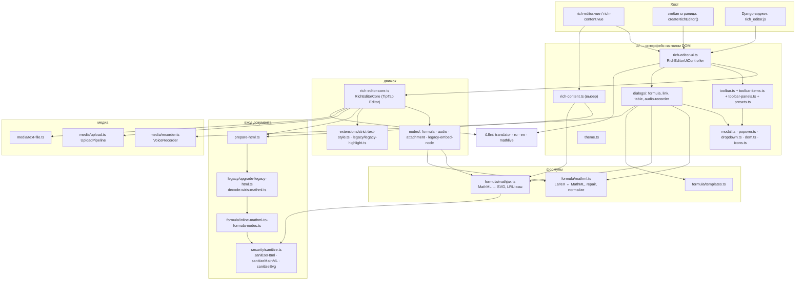

# 1. Обзор и архитектура

## Назначение

Библиотека — rich-text-редактор для образовательной платформы, который
заменяет Froala 4 + Wiris MathType. Ключевые требования, вокруг которых
построен код:

- **формулы (математика и химия) как атомарные узлы**, хранятся в MathML,
  рисуются MathJax, редактируются визуально в MathLive (ADR 0001, 0002, 0003);
- **HTML на входе и на выходе**: документ — обычная HTML-строка, которую можно
  положить в базу, показать на любой странице без редактора и открыть снова;
- **медиа**: изображения, голосовые сообщения (запись в браузере), текстовые
  файлы-вложения — через адаптер загрузки хоста или локально как `blob:` URL;
- **безопасность**: всё, что входит в документ, проходит санитайзер (DOMPurify
  в браузере, `nh3` на сервере в Django-пакете) с одним и тем же allowlist;
- **совместимость с данными Froala/Wiris** без миграции (ADR 0007);
- **интерфейс без фреймворка** на голом DOM, который Vue-обёртка (и любая
  другая) только монтирует (ADR 0008);
- **русский и английский встроены**, другие языки — плоской JSON-таблицей;
- **темизация через CSS-переменные** `--rte-*` без форка стилей (ADR 0006);
- **только MIT/Apache-2.0 зависимости** — коммерческий Wiris SDK не используется.

## Состав монорепозитория

| Каталог | npm/pip-имя | Что это |
| --- | --- | --- |
| `packages/editor-core` | `@rich-editor/core` | Ядро: TipTap/ProseMirror, схема, узлы формул/аудио/вложений, санитайзер, формульный пайплайн, пайплайн загрузок, рекордер, i18n, **и весь интерфейс** (тулбар, диалоги, поповеры, вьюер) на голом DOM, плюс `styles.css` и `legacy.css` |
| `packages/editor-vue` | `@rich-editor/vue` | Тонкая обёртка для Vue 3: компоненты `RichEditor`, `RichContent`, `RteIcon`, плагин `RichEditorPlugin`; реэкспортирует API ядра, чтобы хосту хватало одного пакета |
| `packages/editor-standalone` | `@rich-editor/standalone` | Автономная ES-сборка ядра со всеми зависимостями внутри: `editor.js`, `viewer.js`, ленивые чанки, стили, шрифты MathLive — для страниц без бандлера |
| `packages/django-rich-editor` | `django-rich-editor` (PyPI) | Django-обвязка: виджет формы, поле формы с серверной санитизацией, поле модели, вьюхи загрузок, теги шаблонов; внутрь кладётся standalone-сборка |
| `apps/demo` | `@rich-editor/demo` (private) | Демо из трёх страниц: Vue (`index.html`), ванильное ядро (`vanilla.html`), автономная сборка как статика (`standalone.html`) |
| `tests/e2e` | — | Playwright-сценарии для всех трёх страниц демо (desktop + mobile) |
| `docs/adr` | — | Архитектурные решения 0001–0008 |

Зависимости между пакетами:

```mermaid
graph LR
  core["@rich-editor/core<br/>(TipTap, MathJax, MathLive, DOMPurify)"]
  vue["@rich-editor/vue"] --> core
  standalone["@rich-editor/standalone<br/>(всё внутри)"] --> core
  django["django-rich-editor<br/>(static = dist standalone)"] -. sync-static.mjs .-> standalone
  demo["apps/demo"] --> vue
  demo --> core
  demo -. public/standalone .-> standalone
```

`@rich-editor/core` собирается библиотекой и оставляет TipTap, MathJax, MathLive
и DOMPurify внешними зависимостями (их ставит бандлер хоста). `@rich-editor/standalone`
собирает ядро **из исходников** вместе со всеми зависимостями — так Rollup честно
делит чанки и вьюер не получает ProseMirror.

## Архитектура ядра



Главные принципы (подробнее в ADR 0008 и `ARCHITECTURE.md`):

1. **Интерфейс собирается один раз, на голом DOM, в ядре.** `createRichEditor`
   возвращает полный редактор; Vue-компонент — ~170 строк, которые монтируют
   этот вызов и пробрасывают пропы/события.
2. **Одна точка входа контента.** `prepareIncomingHtml()` обрабатывает и
   начальный `content`, и `setHTML()`, и вставку из буфера, и документ во вьюере.
3. **Возможность — одно объявление.** Пункт тулбара — `ToolbarItemDescriptor`;
   возможность целиком (расширения схемы + пункты + диалоги) — `EditorFeature`.
4. **Ничего реактивного.** Подписи «запекаются» при сборке; смена языка
   пересобирает тулбар и оверлеи; панели дропдаунов пересобираются при каждом
   открытии; оверлеи живут в DOM постоянно и скрываются атрибутом `hidden`.
5. **Классы для модулей с состоянием, стрелочные функции для остального.**
   `RichEditorCore`, `RichEditorUiController`, `ToolbarController`,
   `ModalController`, `PopoverController`, `FormulaDialogController`,
   `AudioRecorderDialogController`, `UploadPipeline`, `VoiceRecorder`,
   `Translator`, `LruCache` — классы; фабрики `create*` остаются тонкими
   обёртками ради стабильного API.

## Потоки данных

### Контент входит

```
HTML хоста (content / setHTML / paste / viewer.update)
  → upgradeLegacyHtml()             только при legacy: Wiris img → формула, MathJax/JSME → legacyEmbed
  → inlineMathMLToFormulaNodes()    сырые <math> → span[data-formula] с нормализованным MathML
  → sanitizeHtml()                  allowlist тегов/атрибутов, схемы URL, CSS, обработчики
  → ProseMirror parse (редактор) / innerHTML (вьюер)
  → node views монтируются, формулы без SVG рисуются MathJax
```

Оба шага апгрейда идут **до** санитайзера: восстановленный MathML сам
проходит `sanitizeMathML`, а часть исходной разметки (например, `` с экранированным MathML в атрибуте) санитайзер иначе
вырезал бы раньше, чем её можно прочитать.

### Контент выходит

```
RichEditorCore.getHTML()
  → ProseMirror serialize
  → FormulaNode.renderHTML читает SVG из кэша MathJax (синхронно)
  → HTML с MathML в data-mathml и SVG в <span data-render-host>
```

`getHTML()` синхронный. Чтобы в экспорте был SVG для каждой формулы, дождитесь
`await core.whenFormulasReady()` — он ждёт все незавершённые рендеры.

### Формула от клика до SVG

```
клик по формуле / Enter на выделенной формуле / кнопка тулбара
  → FormulaNode onEdit({ mathml, type, pos })  →  оболочка: formula dialog.open(payload)
  → mathmlToLatex(mathml)  →  MathLive (LaTeX)
  → «Сохранить»: latexToMathML(latex, type)  →  MathML с <annotation encoding="application/x-tex">
  → core.insertFormula() / core.updateFormulaAt(pos)
  → node view: renderMathML() → sanitizeSvg() → SVG в render host (и в LRU-кэш)
```

## Жизненный цикл редактора (`createRichEditor`)

Реализация — `RichEditorUiController` в `packages/editor-core/src/ui/rich-editor-ui.ts`.

```mermaid
sequenceDiagram
  participant H as Хост
  participant S as RichEditorUiController
  participant C as RichEditorCore (TipTap)
  participant T as Toolbar
  participant O as Оверлеи

  H->>S: createRichEditor(options)
  S->>S: корень .rte-root, applyTheme(theme)
  S->>S: .rte-surface > .rte-host, строка статуса, скрытые <input type=file>
  S->>C: new RichEditorCore({ element: host, extensions: buildExtensions, onError, onUpload, onTransaction, onFormulaEdit })
  C->>C: prepareIncomingHtml(content) → Editor
  S->>S: EditorUiContext { editor, t, limits (getter), uploads, editFormula }
  S->>S: реестр пунктов = SIMPLE_TOOLBAR_ITEMS + панельные + features + options.toolbarItems
  S->>T: createToolbar(context, { groups: resolveToolbar(toolbar) + группы features, items, collapseBelow })
  S->>H: options.element.appendChild(.rte-root)
  S->>O: buildOverlays(): link, table, recorder, formula, linkPopover, диалоги features
  S->>S: refresh(): toolbar.syncState(), linkPopover.sync()
  S->>S: слушатели: rte:modal-close → фокус в документ; change на file-инпутах
  S->>S: applyEditable(editable)
  S-->>H: RichEditorUi { core, element, setEditable, setLocale, setMessages, refreshLabels, setLimits, setTheme, destroy }
```

### Создание

1. Создаётся корень `.rte-root`; к нему применяется тема (`applyTheme`,
   класс `rte-theme-dark` или слежение за `prefers-color-scheme` при `auto`).
2. Создаются область ввода (`.rte-surface > .rte-host`, `minHeight`), строка
   статуса (`role="status" aria-live="polite"`, присутствует в DOM всегда,
   чтобы читалка не пропустила первое объявление) и два скрытых
   `<input type="file">` (картинки — `image/*`, текстовые файлы —
   `TEXT_FILE_ACCEPT`).
3. Создаётся `RichEditorCore`. Его `extensions` — функция, которая получает
   переводчик `t` и возвращает: расширения хоста (`options.extensions`),
   расширения всех `features`, и внутреннее расширение шорткатов оболочки
   (`Alt-F10` → фокус в тулбар, `Mod-k` → диалог ссылки).
4. Собирается реестр пунктов тулбара. Приоритет (позже — главнее):
   встроенные простые → встроенные панельные/диалоговые → пункты `features` →
   `options.toolbarItems`. Так хост одним объектом правит и встроенные пункты,
   и пункты чужой возможности.
5. Создаётся тулбар. Группы — из пресета или явного списка; пункты
   `features`, не упомянутые в конфигурации, добавляются своей группой в конец.
6. Корень вставляется в `options.element`, после чего собираются оверлеи
   (им нужен DOM) и выполняется первая синхронизация.

### Обновления в процессе жизни

| Вызов | Что происходит |
| --- | --- |
| `setEditable(false)` | `editor.setEditable(false)`, класс `rte-root--readonly`, тулбар получает `hidden` (не пересоздаётся) |
| `setLocale(locale)` / `setMessages(messages)` / `refreshLabels()` | `core.setLocale/setMessages`, затем **все оверлеи уничтожаются и собираются заново**, `toolbar.rebuild()`, перерисовка строки статуса. Диалог формул получает новую `locale` для MathLive |
| `setLimits(limits)` | `core.setLimits` → `UploadPipeline.setOptions`; диалог записи читает пределы через getter контекста, поэтому видит новые значения без пересборки |
| `setTheme(theme)` | снимает прежнее слежение `applyTheme`, применяет новое |
| каждая транзакция TipTap | `toolbar.syncState()` (подсветка, доступность, `aria-pressed`, динамические иконки/подписи) и `linkPopover.sync()` |
| `onUpload` из пайплайна | счётчик загрузок по видам → текст строки статуса `upload_image/audio/file` |
| `onError` | текст ошибки в строке статуса на 6 секунд (`ERROR_VISIBLE_MS`) и колбэк хоста |

Что **нельзя** поменять у живого редактора (читается один раз при создании,
потому что меняет схему документа или структуру интерфейса): `legacy`,
`toolbar`, `toolbarItems`, `features`, `extensions`, `linkStyles`,
`placeholder`, `ariaLabel`, `formulaScale`, `minHeight`, `statusLine`,
`collapseBelow`, `textSwatches`/`highlightSwatches`, `mathliveFontsDirectory`,
адаптеры загрузки. Чтобы сменить — пересоздайте редактор (во Vue — `:key`).

### Уничтожение (`destroy()`)

1. Снимается слежение за темой, очищается таймер ошибки.
2. Отписываются слушатели оболочки (`createDisposer`).
3. `toolbar.destroy()` — отключается `ResizeObserver`, уничтожаются дропдауны.
4. Уничтожаются все оверлеи (модалки снимают замок прокрутки документа, если
   были открыты; диалог записи гасит микрофон и отзывает blob превью).
5. `core.destroy()` → `uploads.destroy()` (abort всех загрузок в полёте,
   `URL.revokeObjectURL` для всех созданных blob) и `editor.destroy()`.
6. Корень удаляется из DOM.

Все `destroy()` идемпотентны.

### Жизненный цикл вьюера

`createRichContent` проще: добавляет классы `rte-content-root rte-content`
(+ `rte-legacy`) на переданный элемент, применяет тему, записывает
`prepareIncomingHtml(html)` в `innerHTML`, затем асинхронно дорисовывает
формулы, у которых нет SVG (или все формулы, если `formulaScale !== 1`).
`update()` повторяет это с новыми параметрами; `destroy()` очищает элемент и
снимает классы. Подробности — [06-viewer.md](06-viewer.md).

## Где что лежит

```
packages/editor-core/src/
  index.ts                     публичные реэкспорты (и только они)
  types.ts                     UploadAdapter, EditorLimits, RichEditorError, RichEditorCoreOptions …
  rich-editor-core.ts          RichEditorCore
  prepare-html.ts              prepareIncomingHtml
  styles.css · legacy.css      стили интерфейса/контента и compat-слой Froala
  extensions/strict-text-style.ts
  nodes/        formula.ts · audio.ts · attachment.ts · legacy-embed-node.ts
  formula/      mathml.ts · mathjax.ts · templates.ts · inline-mathml-to-formula-nodes.ts
  media/        upload.ts · recorder.ts · text-file.ts
  security/     sanitize.ts
  legacy/       upgrade-legacy-html.ts · decode-wiris-mathml.ts · legacy-highlight.ts
  i18n/         translator.ts · ru.ts · en.ts · mathlive.ts · index.ts
  ui/           rich-editor-ui.ts · rich-content.ts · toolbar*.ts · presets.ts · types.ts
                modal.ts · popover.ts · dropdown.ts · dom.ts · icons.ts · theme.ts
                link-popover.ts · link-styles.ts · normalize-href.ts · shortcuts.ts · create-color-panel.ts
                dialogs/ formula-dialog.ts · formula-preview.ts · link-dialog.ts · create-table-dialog.ts · audio-recorder-dialog.ts
  utils/        format.ts · lru-cache.ts · focus-editor-view.ts
packages/editor-vue/src/
  index.ts · rich-editor-plugin.ts · styles/index.css
  components/ rich-editor.vue · rich-content.vue · rte-icon.vue
packages/editor-standalone/src/  editor.ts · viewer.ts
packages/django-rich-editor/rich_editor/
  widgets.py · forms.py · fields.py · sanitize.py · views.py · urls.py · conf.py · apps.py
  templatetags/rich_editor.py · templates/rich_editor/*.html
  static/rich_editor/ rich_editor.js · rich_editor_viewer.js (+ синхронизированный dist)
```

> Примечание. `ARCHITECTURE.md` в корне ссылается на `editor.ts` и
> `nodes/legacy-embed.ts`; актуальные имена файлов — `rich-editor-core.ts` и
> `nodes/legacy-embed-node.ts`.
