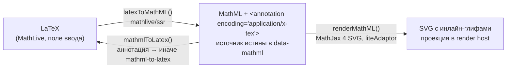

# 4. Формулы: MathML, MathJax, MathLive, шаблоны, химия

Файлы: `packages/editor-core/src/formula/*`, `nodes/formula.ts`,
`ui/dialogs/formula-dialog.ts`, `ui/dialogs/formula-preview.ts`,
`i18n/mathlive.ts`. Решения — ADR 0002 (MathLive + аннотация), 0003 (MathJax
SVG), 0004 (контракт в HTML), 0005 (химия).

## 4.1. Модель



- **MathML — канонический формат.** Он хранится в `data-mathml`, он же
  рендерится и он же сравнивается. Внутри `<semantics>` вместе с ним едет
  LaTeX-аннотация, потому что MathLive умеет экспортировать MathML, но не
  умеет его читать (ADR 0002).
- **SVG — переносимая проекция.** Вставляется в документ, чтобы экспорт
  показывался где угодно без MathJax; при импорте выбрасывается и
  восстанавливается из MathML (атом не хранит детей), так что подменённый SVG
  не переживает редактор.
- **Тип `math | chem`** — на узле (`data-formula-type`) и внутри MathML
  (атрибут `data-formula-type` на `<math>`), так что различие переживает
  экспорт и выбирает набор шаблонов при повторном открытии.

Пример хранимого MathML:

```xml
<math xmlns="http://www.w3.org/1998/Math/MathML" display="inline" data-formula-type="math">
  <semantics>
    <mrow><mfrac><mi>a</mi><mi>b</mi></mfrac></mrow>
    <annotation encoding="application/x-tex">\frac{a}{b}</annotation>
  </semantics>
</math>
```

## 4.2. `formula/mathml.ts`

```ts
const MATHML_NS = 'http://www.w3.org/1998/Math/MathML';
const TEX_ANNOTATION_ENCODING = 'application/x-tex';

const buildMathML: (body: string, latex: string, type: FormulaType) => string;
const extractTexAnnotation: (mathml: string) => string | null;
const extractFormulaType: (mathml: string) => FormulaType;         // 'chem', если data-formula-type="chem", иначе 'math'
const latexToMathML: (latex: string, type?: FormulaType) => Promise<string>;  // '' для пустого/неконвертируемого
const mathmlToLatex: (mathml: string) => Promise<string>;           // аннотация, иначе mathml-to-latex, иначе ''
const repairMathML: (mathml: string) => string;
const isMathMLEmpty: (mathml: string) => boolean;
const normalizeMathML: (mathml: string) => string;                 // sanitizeMathML → проверка пустоты → repairMathML; '' если непригодно
```

- `buildMathML` оборачивает тело в `<mrow>` (если оно не начинается с него),
  ставит `xmlns`, `display="inline"`, `data-formula-type` и аннотацию с
  экранированным LaTeX.
- `latexToMathML` лениво импортирует `mathlive/ssr` (конвертер без
  веб-компонента) — `convertLatexToMathMl(latex)`.
- `mathmlToLatex` сначала читает аннотацию (без потерь), иначе лениво
  импортирует `mathml-to-latex` для структурной конвертации (для MathML из
  других инструментов; экзотическая разметка может упроститься — см.
  `LIMITATIONS.md`).
- `repairMathML` чинит то, на чём MathJax падает: голый текст внутри
  не-токенных элементов оборачивает в `<mo>`, пустой текст удаляет, скриптам
  (`msub msup munder mover mfrac mroot` — 2 ребёнка, `msubsup munderover` — 3)
  добавляет недостающие `<mrow>`. Это защита от двух реальных багов экспорта
  MathLive (`\longrightarrow`, `{}^{14}_{6}\mathrm{C}`).
- `normalizeMathML` — единственная точка валидации MathML извне: `setHTML`,
  вставка, `insertFormula`, `data-mathml` при разборе узла, legacy-апгрейд.
- `formulaAccessibleName(mathml)` (внутренняя) — имя для читалки: аннотация,
  иначе текст MathML без тегов.

## 4.3. `formula/mathjax.ts` — рендер в SVG

```ts
const DEFAULT_FORMULA_FONT_SIZE_PX = 15;
interface RenderOptions { display?: boolean; fontSizePx?: number }

const renderMathML: (mathml: string, options?: RenderOptions) => Promise<string>;   // '' при неудаче, никогда не отклоняется
const getCachedFormulaSvg: (mathml: string, fontSizePx?: number) => string | undefined;
const whenFormulasReady: () => Promise<void>;
const resetMathJax: () => void;   // тестовый шов
```

Движок создаётся лениво при первом рендере из `@mathjax/src` 4.x:

- вход `MathML` (`parseAs: 'html'`), выход `SVG` с `fontCache: 'local'` —
  глифы инлайнятся в каждый SVG, экспорт автономен;
- шрифт `@mathjax/mathjax-newcm-font`;
- `linebreaks: { inline: false, width: '100000em' }` — формула всегда один
  `<svg>`, а не несколько строк;
- `liteAdaptor` — без DOM, одинаково работает в браузере, Node и jsdom;
- `mathjax.handleRetriesFor()` — глифы вне предзагруженного набора (кириллица,
  редкие операторы) MathJax догружает асинхронно, сигналя исключением.

**Размер запекается в пикселях.** MathJax размечает `width`/`height`/
`vertical-align` в `ex`, а браузерный `ex` зависит от шрифта и кегля
окружения — та же формула получалась 16.6 px в абзаце и 29.5 px в `h1`.
`freezeSizeInPixels` переводит `ex` в `px` по измеренному отношению x-height
к кеглю шрифта контента (`REFERENCE_EX_RATIO = 0.6` для Golos при 15 px).
Поэтому масштаб — параметр рендера `fontSizePx = 15 * formulaScale`, а не
`font-size` хоста, и **входит в ключ кэша** (`${fontSizePx}|${mathml}`).

Кэш — `LruCache<string, string>` на 500 записей на уровне модуля; он и
делает `getHTML()` синхронным: node view заполняет кэш при отрисовке,
`renderHTML` читает его. `whenFormulasReady()` ждёт все рендеры в полёте и
повторяет проверку, пока множество не опустеет.

Из `mjx-container` берётся только `<svg …>…</svg>`; результат проходит
`sanitizeSvg` **до** попадания в кэш — в документ никогда не попадает
несанитизированный SVG.

## 4.4. Узел формулы и масштаб

`FormulaNode.configure({ onEdit, scale })` — `scale` приходит из
`formulaScale`. Node view рисует SVG из кэша синхронно, иначе показывает `…`
и ждёт `renderMathML`; при неудаче — `⚠`. Устаревший рендер (узел уже
сменил MathML) отбрасывается. Подробности узла — [02-core.md](02-core.md#узел-формулы-nodesformulats).

Во вьюере (`createRichContent`) формула с готовым SVG не перерисовывается
при `formulaScale === 1`; при другом масштабе перерисовываются все —
пиксели в SVG на `font-size` не реагируют.

## 4.5. Диалог формул

`createFormulaDialog(context, { fontsDirectory, locale, onSave, onRemove })`
(внутренняя фабрика; оболочка создаёт его сама). Класс
`FormulaDialogController`:

1. **Открытие** `open(payload | null)`: тип из `payload.type` (по умолчанию
   `math`), заголовок `formula_title_math|chem`, первая категория типа,
   пересборка категорий и галереи, статус `idle`, `modal.open()`, затем
   асинхронно `prepareField(token)`.
2. **MathLive** грузится лениво `import('mathlive')` при первом показе:
   `MathfieldElement.soundsDirectory = null`, `fontsDirectory` (если опция не
   `undefined`), `strings = MATHLIVE_STRINGS`, `locale`; создаётся
   `new MathfieldElement({ defaultMode: 'math', mathVirtualKeyboardPolicy: 'manual' })`
   с `data-autofocus`, `aria-label` и `aria-describedby` подсказки. Экранная
   клавиатура MathLive выключена (кнопка скрыта в CSS) — её роль играет
   галерея шаблонов. Пока грузится — `formula_loading` в `role="status"`;
   при ошибке — `formula_invalid`.
3. Для правки `mathmlToLatex(payload.mathml)` → `field.value`. Токен
   открытия защищает от гонки: если диалог переоткрыли, пока грузился
   MathLive, старый результат отбрасывается.
4. **Вкладки** `math`/`chem` меняют заголовок, категории, галерею и превью (одна
   и та же запись выглядит по-разному в двух режимах — например, `\mathrm`).
5. **Галерея**: кнопки шаблонов текущей категории, превью рисуется только
   для видимой категории; `getCachedLatexPreview` читается синхронно, чтобы
   галерея не моргала заглушкой при повторном открытии. Клик вставляет
   `template.latex` в поле (`field.insert(latex, { selectionMode:
   'placeholder', focus: true })`) — `\placeholder{}` становятся табстопами.
6. **Превью** — `renderLatexPreview(latex, type)`; пустая формула →
   `formula_empty`, неудача → `formula_invalid`. Токен превью отбрасывает
   устаревшие ответы.
7. **Сохранить**: `latexToMathML(latex, type)` → `onSave({ mathml, type, pos })`;
   оболочка зовёт `core.insertFormula` (pos `null`) или
   `core.updateFormulaAt`. **Удалить** → `onRemove(pos)` →
   `core.deleteFormulaAt`.

### Превью (`formula-preview.ts`)

```ts
const renderLatexPreview: (latex: string, type?: FormulaType, scale?: number) => Promise<string>;
const getCachedLatexPreview: (latex: string, type?: FormulaType, scale?: number) => string | undefined;
const clearPreviewCache: () => void;
```

`\placeholder{}` заменяется на `\square` перед конвертацией; кэш — LRU на
300 записей с ключом `тип\0масштаб\0latex`; неудачный рендер не кэшируется.
Экспортируются из пакета: хост может рисовать свои превью тем же пайплайном.

## 4.6. Шаблоны (`formula/templates.ts`)

```ts
type TemplateCategoryId = 'basic' | 'fractions' | 'roots' | 'scripts' | 'sums' | 'integrals' | 'limits'
  | 'matrices' | 'greek' | 'relations' | 'functions' | 'chemReactions' | 'chemStates' | 'chemIsotopes' | 'chemPatterns';

interface FormulaTemplate { id: string; category: TemplateCategoryId; latex: string; preview: string }
interface TemplateCategory { id: TemplateCategoryId; type: FormulaType; labelKey: string; templates: FormulaTemplate[] }

const TEMPLATE_CATEGORIES: TemplateCategory[];
const getTemplateCategories: (type: FormulaType) => TemplateCategory[];
const findTemplate: (id: string) => FormulaTemplate | undefined;   // id вида 'fractions.frac'
```

- `latex` — что вставляется в поле (с `\placeholder{}`), `preview` — что
  рисуется в галерее (конкретный пример: `\frac{a}{b}`).
- Математика (11 категорий): основное (скобки, модуль, норма, ∞, градусы,
  проценты), дроби (включая `\binom`, `\cfrac`, производные), корни,
  индексы и диакритика (`\bar \vec \hat \tilde \dot \ddot`), суммы и
  произведения, интегралы, пределы, матрицы, греческие буквы, отношения,
  функции.
- Химия (4 категории, 36 шаблонов): реакции (`\rightarrow`,
  `\rightleftharpoons`, `\rightleftarrows`, катализатор через
  `\overset{…}{\rightarrow}`, осадок `\downarrow`, газ `\uparrow`, примеры
  реакций), состояния и заряды (`(\mathrm{s})`, `(\mathrm{aq})`, `^{+}`,
  `^{2-}`), изотопы (`{\,}^{14}_{6}\mathrm{C}` — с пустой группой-базой),
  типовые формулы (`\mathrm{H}_2\mathrm{O}` и др.).
- Каталог фиксированный: пользовательского редактора шаблонов нет.
- Намеренно **исключены** команды, которые MathLive экспортирует в MathML с
  потерями: `\overline`, `\underline`, `\overbrace`, `\underbrace`,
  `\overrightarrow`, `\longrightarrow`, `\xrightarrow`, `\iff`
  (таблица замен — `LIMITATIONS.md`). Тест `templates.test.ts` прогоняет
  **каждый** шаблон через реальный пайплайн MathLive → MathML → MathJax.

## 4.7. Химические формулы (ADR 0005)

Химия — тот же пайплайн, что и математика: MathLive для ввода, MathML для
хранения, MathJax для рендера. Отличия — набор шаблонов и маркер `chem`.
Поддерживается уровень «уравнения и нотация»: символы элементов
(`\mathrm{…}` — прямой шрифт), индексы, заряды, агрегатные состояния,
изотопы с прескриптами, стрелки реакций с надписью. **Структурные формулы**
(кольца, связи, стереохимия) **не поддерживаются** — для них нужны MOL/SMILES
и отдельный узел; ADR 0005 описывает точку расширения (узел-сосед
`chemStructure`).

Старые структурные формулы из JSME в legacy-режиме сохраняются как
`legacyEmbed` без редактирования.

## 4.8. Программная работа с формулами

```ts
import { latexToMathML, mathmlToLatex, renderMathML, normalizeMathML } from '@rich-editor/core';

// вставить формулу в редактор
const mathml = await latexToMathML('2\\mathrm{H}_2+\\mathrm{O}_2\\rightarrow 2\\mathrm{H}_2\\mathrm{O}', 'chem');
editor.core.insertFormula(mathml, 'chem');

// получить SVG для своего рендера (например, в письме)
const svg = await renderMathML(mathml, { fontSizePx: 18 });

// проверить MathML, пришедший извне
if (!normalizeMathML(untrusted)) showError();

// LaTeX из сохранённой формулы
const latex = await mathmlToLatex(mathml);
```

Готовый HTML с формулами, созданный на бэкенде, может содержать либо полный
контракт `span[data-formula]`, либо просто `<math>…</math>` — второе
`prepareIncomingHtml` поднимет до контракта автоматически (и редактор, и
вьюер).

## 4.9. Шрифты MathLive

MathLive рисует поле ввода своими шрифтами (семейства `KaTeX_*`). Варианты:

- с бандлером: `import 'mathlive/fonts.css'` — Vite/webpack вынесут файлы
  шрифтов; тогда `mathliveFontsDirectory: null` (значение по умолчанию у
  `createRichEditor` и Vue-компонента);
- раздавать самим: `mathliveFontsDirectory: '/fonts/mathlive'`;
- автономная сборка: `editor.js` сам подставляет `fonts/` рядом с собой
  (`MATHLIVE_FONTS_DIRECTORY`), явная опция главнее.

MathJax шрифты не нужны: контуры глифов внутри SVG.

## 4.10. Локализация MathLive

MathLive поставляется с de/en/es/fr/it/ja/pl. Русская таблица `mathliveRu`
(`i18n/mathlive.ts`) покрывает контекстное меню, подсказки панели и экранную
клавиатуру и подключается через `MathfieldElement.strings = MATHLIVE_STRINGS`
(`{ ru: mathliveRu }`); ключи повторяют идентификаторы MathLive, `%@` — его
подстановка. Записи `*-template` (LaTeX, не текст) намеренно не переведены.
Тест `mathlive-i18n.test.ts` сверяет ключи с реальным MathLive — при
обновлении зависимости с переименованными ключами он упадёт, а меню не
откатится в английский молча. Локаль MathLive берётся из `locale` редактора
при создании диалога (и обновляется при `setLocale`, так как диалог
пересобирается).
