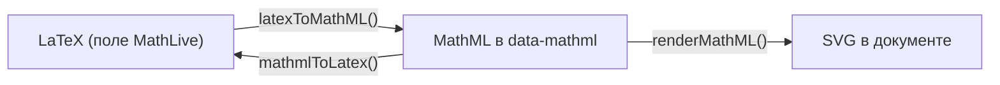

# 4. Формулы

## Назначение

Формула — атомарный инлайновый узел документа. Источник истины — MathML в
атрибуте `data-mathml` (внутри него LaTeX-аннотация для повторного
редактирования); SVG, отрисованный MathJax, едет в HTML, чтобы документ
показывался без MathJax. Тип `math` или `chem` хранится на узле и внутри
MathML и выбирает набор шаблонов при повторном открытии. Пользователь правит
формулу визуально в MathLive; клик по формуле или `Enter` на выделенной
открывает её редактор.



## Когда использовать

- Через интерфейс — ничего настраивать не нужно: кнопки `formulaMath` и
  `formulaChem` открывают диалог с шаблонами и предпросмотром.
- Программно — когда формулы приходят с бэкенда, нужен SVG вне документа или
  нужно проверить MathML извне.

## Интерфейс

Сигнатуры — [14-api-reference.md](14-api-reference.md#формулы).

### Конвертация и проверка

| Функция | Возвращает | Что делает |
| --- | --- | --- |
| `latexToMathML(latex, type?)` | `Promise<string>` | LaTeX → MathML с аннотацией; `''`, если конвертировать нечего |
| `mathmlToLatex(mathml)` | `Promise<string>` | Аннотация без потерь, иначе структурная конвертация; `''` при неудаче |
| `normalizeMathML(mathml)` | `string` | Санитизация, проверка на пустоту, починка структуры; `''`, если непригодно |
| `buildMathML(body, latex, type)` | `string` | Собирает `<math>` с `xmlns`, типом и аннотацией из готового тела |
| `extractTexAnnotation(mathml)` | `string` или `null` | LaTeX из аннотации |
| `extractFormulaType(mathml)` | `FormulaType` | `'chem'`, если на `<math>` стоит `data-formula-type="chem"`, иначе `'math'` |
| `repairMathML(mathml)`, `isMathMLEmpty(mathml)` | `string`, `boolean` | Части `normalizeMathML`, доступны отдельно |
| `inlineMathMLToFormulaNodes(html)` | `string` | Сырые `<math>` в HTML → узлы формул; вызывается из `prepareIncomingHtml` |

### Рендер

| Функция | Возвращает | Что делает |
| --- | --- | --- |
| `renderMathML(mathml, { display?, fontSizePx? })` | `Promise<string>` | SVG с инлайн-глифами, размер запечён в пикселях; `''` при неудаче, не бросает |
| `getCachedFormulaSvg(mathml, fontSizePx?)` | `string` или `undefined` | Синхронное чтение кэша |
| `whenFormulasReady()` | `Promise<void>` | Ждёт все рендеры в полёте |
| `renderLatexPreview(latex, type?, scale?)` | `Promise<string>` | SVG превью прямо из LaTeX (как в галерее диалога); `\placeholder{}` → `\square` |
| `getCachedLatexPreview(latex, type?, scale?)` | `string` или `undefined` | Синхронное чтение кэша превью |
| `DEFAULT_FORMULA_FONT_SIZE_PX` | `15` | Кегль, под который рендерится формула при `formulaScale: 1` |

Масштаб формулы — опция `formulaScale` редактора и вьюера (`fontSizePx = 15 × scale`),
а не `font-size` окружения: пиксели в SVG на него не реагируют.

### Шаблоны

`TEMPLATE_CATEGORIES` — каталог категорий `{ id, type, labelKey, templates }`;
`getTemplateCategories(type)` фильтрует по `'math'` или `'chem'`;
`findTemplate(id)` ищет по id вида `'fractions.frac'`. У шаблона `latex` — что
вставляется в поле (с `\placeholder{}` как табстопами), `preview` — конкретный
пример для галереи.

| Тип | Категории (`TemplateCategoryId`) |
| --- | --- |
| `math` | `basic fractions roots scripts sums integrals limits matrices greek relations functions` |
| `chem` | `chemReactions chemStates chemIsotopes chemPatterns` |

Каталог фиксированный: пользовательского редактора шаблонов нет.

### Хранимый MathML

```xml
<math xmlns="http://www.w3.org/1998/Math/MathML" display="inline" data-formula-type="math">
  <semantics>
    <mrow><mfrac><mi>a</mi><mi>b</mi></mfrac></mrow>
    <annotation encoding="application/x-tex">\frac{a}{b}</annotation>
  </semantics>
</math>
```

HTML с бэкенда может содержать либо полный контракт `span[data-formula]`
([02](02-core.md#формат-сохраняемого-html)), либо просто `<math>…</math>` —
второе редактор и вьюер поднимут до узла сами.

### Шрифты и локаль MathLive

| Ситуация | Что сделать |
| --- | --- |
| Бандлер (Vite, webpack) | Ничего: редактор импортирует `mathlive/fonts.css` сам, бандлер выдаёт файлы шрифтов; `mathliveFontsDirectory` остаётся `null` |
| Шрифты раздаются самостоятельно | `mathliveFontsDirectory: '/fonts/mathlive'` |
| Standalone-сборка | `editor.js` сам берёт соседний `fonts/`; явная опция главнее |

MathJax шрифтов не требует: контуры глифов внутри SVG. Меню и подсказки MathLive
переведены на русский таблицей `MATHLIVE_STRINGS` ([09](09-i18n.md#строки-mathlive)).

## Пример

```ts
import { latexToMathML, renderMathML, normalizeMathML } from '@rich-editor/core';

const mathml = await latexToMathML('2\\mathrm{H}_2+\\mathrm{O}_2\\rightarrow 2\\mathrm{H}_2\\mathrm{O}', 'chem');
editor.core.insertFormula(mathml, 'chem');

const svg = await renderMathML(mathml, { fontSizePx: 18 }); // для письма или PDF
if (!normalizeMathML(untrustedMathml)) showError();          // MathML извне
```

## Ограничения

- MathLive экспортирует с потерями `\overline`, `\underline`, `\overbrace`,
  `\underbrace`, `\overrightarrow`, `\longrightarrow`, `\xrightarrow`, `\iff`;
  шаблоны их обходят, таблица замен — в `LIMITATIONS.md`.
- Чужой MathML без аннотации при повторном открытии конвертируется структурно
  и может упроститься после сохранения; показывается он без потерь.
- Химия — уравнения и нотация; структурных формул (кольца, связи) нет
  (`docs/adr/0005-chemistry-scope.md`).
- Для читалки имя формулы — её LaTeX (`role="img"`); речевого описания и
  навигации по выражению нет.

## См. также

- [02-core.md](02-core.md) — `insertFormula`, `updateFormulaAt`, `onFormulaEdit`.
- `docs/adr/0002-math-editor-and-mathml.md`, `docs/adr/0003-mathjax-rendering.md`,
  `docs/adr/0004-formula-html-contract.md`.
